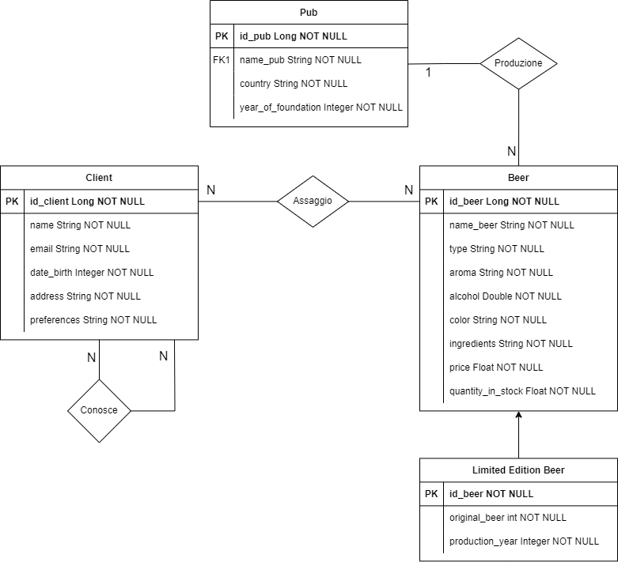

# 2023_assignment3_BEerConnect

Link Repo GitLab https://gitlab.com/bicoccaprojects/2023_assignment3_beerconnect

Partecipanti

- Ficara Damiano - 919386

- Ricci Claudio - 918956

Entità:

- Cliente: ID, Nome, Email, Data di Nascita, Indirizzo di Spedizione, Preferenze di Gusto

- Birrificio: ID Birrificio, Nome, Località, Anno di Fondazione

- Birra: ID Birra, Nome, Tipo (Lager, Ale, Stout, ecc.), Grado Alcolico, IBU (Unità Bitterness)

- Edizione Limitata: ID Edizione, Nome Birra Originale, Nome Edizione Limitata, Anno di Produzione, Quantità Limitata

Relazioni:

- Produzione (tra Birrificio e Birra): Un Birrificio può produrre molte Birre, ma una Birra è prodotta da un solo Birrificio (one-to-many).

- Assaggio (tra Cliente e Birra): Un Cliente può assaporare molte Birre, e una Birra può essere assaporata da molti Clienti (many-to-many).

- Conosce (relazione self-loop su Cliente): Un cliente può conoscere altri clienti. Questa relazione rappresenta la connessione tra i clienti o degustatori esperti che si conoscono all'interno della comunità birraia.

- Recensione (tra Cliente e Birra): Un Cliente può scrivere molte Recensioni, ma una Recensione è associata a un solo Cliente e a una sola Birra (many-to-one).

- Edizione Speciale (tra Birra e Edizione Limitata): Una Birra può avere una sola Edizione Limitata, e un'Edizione Limitata è associata a una sola Birra (one-to-one).

  

Questo contesto consente agli utenti di esplorare una vasta gamma di birre prodotte dai birrifici, assaporare le birre, condividere opinioni attraverso recensioni e conoscere altri appassionati di birra all'interno di una comunità. L'aggiunta dell'entità "Edizione Limitata" consente di gestire particolari versioni speciali e limitate di birre.
